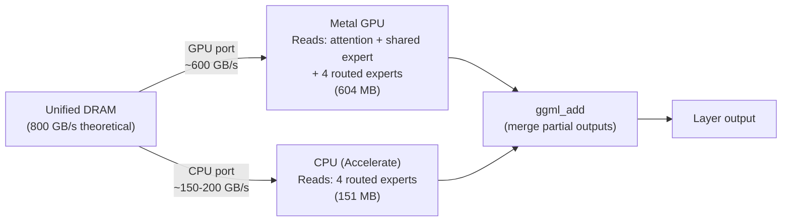

# CPU Expert Bandwidth Offload — Implementation Plan

> **Target Repo**: `ik_llama.cpp`
> **Target Hardware**: Apple M3 Ultra (24-core CPU, 76-80 GPU cores, 192GB unified, 800 GB/s shared)
> **Date**: 2026-02-24

---

## Table of Contents

1. [Executive Summary](#1-executive-summary)
2. [Architecture Overview](#2-architecture-overview)
3. [SWOT Analysis](#3-swot-analysis)
4. [Knowns and Unknowns](#4-knowns-and-unknowns)
5. [Edge Cases and Failure Modes](#5-edge-cases-and-failure-modes)
6. [Memory Bandwidth Model](#6-memory-bandwidth-model)
7. [Performance Model](#7-performance-model)
8. [Phased Implementation](#8-phased-implementation)
9. [File-by-File Specifications](#9-file-by-file-specifications)
10. [Test Plans](#10-test-plans)
11. [Risk Register](#11-risk-register)
12. [CLI Reference](#12-cli-reference)

---

## 1. Executive Summary

### Problem

MoE model decode (token generation) is **memory-bandwidth-bound**, not compute-bound. At seq=1, per-layer matmuls take microseconds but reading expert weights from DRAM takes milliseconds. The GPU alone achieves ~600 GB/s of the M3 Ultra's ~800 GB/s theoretical bandwidth. The remaining ~200 GB/s is untapped.

### Solution

Route a fraction of routed expert weight tensors to the **CPU backend** during decode. The CPU reads these weights through its own memory controller ports while the GPU reads the rest through GPU ports. Both compute simultaneously. Since compute is negligible at seq=1, this is purely a **memory bandwidth amplification** strategy.

### Key Insight

This is NOT about CPU compute power — it's about CPU **memory access bandwidth**. The CPU's memory reads go through different fabric ports than the GPU's, increasing total bytes/second from DRAM. The actual matmul computation is trivially fast at seq=1 on either device.

### Expected Impact

| Model | Config | Decode tok/s | Speedup |
|-------|--------|-------------|---------|
| Qwen 397B A17B MoE (Q8_0) | GPU-only | ~12.4 | 1.0× |
| Qwen 397B A17B MoE (Q8_0) | GPU+CPU (4 experts offloaded) | **~15.5** | **1.25×** |

### Why Not ANE?

CoreML's ~1ms prediction overhead per call exceeds the entire weight-read time per expert at seq=1 (~0.13ms). The CPU has **zero framework overhead** — it uses the existing `ggml_backend_cpu` which is just a function call.

### Complexity

This is dramatically simpler than the GPU+ANE prefill plan. It uses **existing ggml infrastructure** — no new backends, no Objective-C++, no CoreML. The primary change is routing expert tensor backends at model load time.

---

## 2. Architecture Overview

### 2.1 Normal Decode Path (GPU-Only)

```
Per layer (seq=1, Qwen 397B):
  GPU reads 755 MB of weights from DRAM
  GPU computes matmuls (trivially fast at seq=1)
  Time = 755 MB / 600 GB/s = 1.26ms
```

### 2.2 Bandwidth-Split Decode Path



### 2.3 Per-Layer Timeline

```
Time    GPU                                CPU
─────── ──────────────────────────         ──────────────────────
0.0ms   Read attention + shared expert     Read 4 routed experts
        + 4 routed experts (604 MB)        (151 MB)
        Compute all assigned ops           Compute 4 expert matmuls
0.50ms                                     CPU done (151/150 ≈ 1.01ms)
                                           ... wait for GPU ...
1.01ms  GPU done (604/600 ≈ 1.01ms)       ← balanced!
        ─── merge expert outputs ───
1.01ms  ═══ LAYER COMPLETE ═══
```

### 2.4 How It Hooks Into Existing Code

The `ggml_backend_sched` already supports multi-backend execution. Expert weights are stored as 3D tensors `[n_embd, n_ff, n_expert]`. The scheduler can split `ggml_mul_mat_id` ops across backends when different expert slices are assigned to different backends.

**Key existing APIs used:**

| API | File | Purpose |
|-----|------|---------|
| `ggml_backend_sched_set_tensor_backend()` | `ggml-backend.h:196` | Route specific tensors to CPU backend |
| `ggml_backend_sched_graph_compute_async()` | `ggml-backend.h:200` | Compute graph across backends |
| `ggml_mul_mat_id()` | `llama-build-context.cpp:564` | Expert dispatch with index routing |
| `ggml_backend_cpu_set_n_threads()` | `ggml-backend.h` | Control CPU thread count |
| `hparams.n_expert`, `n_expert_used` | `llama-hparams.h:33-34` | Model expert configuration |

### 2.5 The Expert Weight Layout

Expert weights in ik_llama.cpp are stored as **3D tensors** (all experts packed):

```cpp
// From llama-load-tensors.cpp:500
layer.ffn_gate_exps = create_tensor(tn(LLM_TENSOR_FFN_GATE_EXPS, "weight", i),
                                     {n_embd, n_ff, n_expert});
layer.ffn_down_exps = create_tensor(tn(LLM_TENSOR_FFN_DOWN_EXPS, "weight", i),
                                     {n_ff, n_embd, n_expert});
layer.ffn_up_exps   = create_tensor(tn(LLM_TENSOR_FFN_UP_EXPS, "weight", i),
                                     {n_embd, n_ff, n_expert});
```

The `ggml_mul_mat_id` op selects which slices of this 3D tensor to use based on router output indices. To offload specific experts to CPU, we need to either:

**Option A**: Split the 3D tensor into separate per-expert 2D tensors, assigning some to CPU backend — requires modifying tensor creation.

**Option B**: Create CPU-side copies of the full 3D expert tensors and use `ggml_backend_sched_set_tensor_backend` to route the `mul_mat_id` op to CPU — simpler but reads all experts on CPU even if only some are needed.

**Option C (Recommended)**: Create a **hybrid expert buffer** — the full 3D tensor remains on GPU, but a CPU buffer holds copies of the N offloaded experts' slices. A custom dispatch in the build context uses separate `ggml_mul_mat` calls for CPU-side experts instead of `ggml_mul_mat_id`, then merges results.

> [!IMPORTANT]
> Option C requires modifying the MoE build path in `llm_build_context::build_moe_ffn()` to emit separate matmul ops for CPU-offloaded experts vs GPU experts. This is more work than a simple backend assignment but gives precise per-expert control.

---

## 3. SWOT Analysis

### Strengths

| # | Strength |
|---|----------|
| S1 | **No new backend** — uses existing `ggml_backend_cpu` and `ggml_backend_sched` |
| S2 | **Zero framework overhead** — CPU matmul is a function call, not a CoreML prediction |
| S3 | **Pure bandwidth gain** — increases effective DRAM throughput from ~600 to ~750 GB/s |
| S4 | **MoE-specific** — experts are naturally independent, perfect for parallel reads |
| S5 | **Independent of ANE plan** — can be implemented and shipped separately |
| S6 | **Low memory overhead** — CPU buffer holds only offloaded expert slices (~150 MB) |
| S7 | **Applicable to all Apple Silicon** — M1/M2/M3/M4 all have separate CPU memory ports |

### Weaknesses

| # | Weakness | Mitigation |
|---|----------|------------|
| W1 | Only benefits MoE models (not dense) | Target Qwen 397B, DeepSeek-V3, Mixtral |
| W2 | Only benefits decode (not prefill) | Prefill is compute-bound; separate ANE plan handles it |
| W3 | CPU compute is slower than GPU | At seq=1, compute is negligible — irrelevant |
| W4 | ~25% speedup is modest | Free performance with minimal engineering effort |
| W5 | Requires modifying MoE build path | Localized change in `build_moe_ffn()` |
| W6 | Actual bandwidth gain depends on fabric topology | Must benchmark empirically |

### Opportunities

| # | Opportunity |
|---|------------|
| O1 | Extends to dense models if individual layers split between GPU+CPU (layer-level offload already exists) |
| O2 | Enables "partial offload" — some experts GPU, some CPU — finer than per-layer offload |
| O3 | Could combine with ANE plan: GPU attention + ANE shared expert + CPU routed experts |

### Threats

| # | Threat | Mitigation |
|---|--------|------------|
| T1 | CPU reads contend with GPU on same memory channel | Benchmark per-channel allocation strategy |
| T2 | CPU cache pollution from large expert reads | Pin CPU expert reads with non-temporal loads if available |
| T3 | macOS scheduler migrates compute threads | Pin Accelerate threads to performance cores |

---

## 4. Knowns and Unknowns

### Known Knowns

| Fact | Source |
|------|--------|
| M3 Ultra has 800 GB/s theoretical unified memory bandwidth | Apple specs |
| GPU alone achieves ~600 GB/s effective bandwidth | Empirical benchmarks |
| Expert weights are 3D tensors `[n_embd, n_ff, n_expert]` | `llama-load-tensors.cpp:500` |
| `ggml_mul_mat_id` dispatches expert routing | `llama-build-context.cpp:564` |
| `ggml_backend_sched` supports multi-backend execution | `ggml-backend.h` |
| CPU backend exists and supports all ggml ops | `ggml-backend.cpp` |
| Decode matmul at seq=1 is trivially fast (~μs) | Arithmetic analysis |
| MoE expert selection is known before matmul execution | Router runs first |
| Qwen 397B has 64 experts, 8 active per token | Model spec |

### Known Unknowns

| # | Unknown | When | How |
|---|---------|------|-----|
| U1 | Actual CPU memory bandwidth on M3 Ultra | Phase 1 | Benchmark with `memcpy` and Accelerate |
| U2 | Whether GPU+CPU concurrent reads achieve additive bandwidth | Phase 1 | Profile concurrent access |
| U3 | Optimal number of experts to offload (2, 3, or 4) | Phase 2 | Sweep with auto-benchmark |
| U4 | CPU cache pollution impact on other workloads | Phase 2 | Monitor via `perf` counters |
| U5 | Whether `ggml_mul_mat_id` can be split across backends | Phase 1 | Test with backend scheduler |
| U6 | Impact on prefill (where we DON'T want CPU experts) | Phase 2 | Conditional: only CPU-route during decode |

### Unknown Unknowns

| # | Risk | Detection |
|---|------|-----------|
| X1 | Apple Silicon fabric may serialize GPU+CPU DRAM access | Phase 1 concurrent benchmark |
| X2 | CPU DRAM reads may go through GPU's memory controller anyway | Monitor with Instruments |
| X3 | Unified memory means "same physical channel" on certain configs | Test on multiple hardware |

---

## 5. Edge Cases and Failure Modes

### 5.1 Model Architecture Edge Cases

| Edge Case | Behavior | Mitigation |
|-----------|----------|------------|
| Dense model (no experts) | No experts to offload | Disable feature, GPU-only |
| MoE with n_expert=2 | Only 2 experts total, overhead may not justify | Auto-benchmark threshold |
| Shared expert only (no routed) | No routed experts to offload | Only shared expert runs on GPU |
| n_expert_used=1 (top-1 routing) | Only 1 expert active per token | Offload makes less sense (tiny weight read) |
| Variable expert activation (min_expert) | Some tokens activate fewer experts | CPU work may finish very early (wait for GPU) |
| Fused gate+up expert tensor | Some models fuse gate+up into one tensor | Handle both fused and separate layouts |

### 5.2 Runtime Edge Cases

| Edge Case | Behavior | Mitigation |
|-----------|----------|------------|
| Prefill phase (seq > 1) | CPU is too slow for compute-bound work | **Only route experts to CPU during decode (seq=1 or small batches)** |
| Mixed prefill+decode batch | Batch contains both prefill and decode tokens | Conservative: use GPU-only for mixed batches |
| System under CPU load | Other processes using CPU cores | Reduce CPU expert count or disable |
| M1 (8 cores, lower bandwidth) | CPU bandwidth ~50 GB/s | Benchmark may show no benefit; auto-disable |
| Model partially offloaded to CPU already | Some layers already on CPU via `--n-gpu-layers` | Don't double-offload — skip expert CPU routing for CPU-resident layers |

### 5.3 Numerical Edge Cases

| Edge Case | Behavior | Mitigation |
|-----------|----------|------------|
| CPU and GPU produce different matmul results | Different SIMD paths may have different rounding | Verify bit-exact for Q8_0/F16; tolerance for smaller quants |
| Expert output accumulation order | GPU experts + CPU experts summed in different order | Floating-point addition is approximately commutative at FP16 |

---

## 6. Memory Bandwidth Model

### Apple Silicon Memory Architecture (Research Findings)

```
┌──────────────────────────────────────────────────────────────┐
│                    Unified DRAM (LPDDR5-6400)                │
│  M3 Ultra = 2× M3 Max = 64 memory controllers (16-bit each) │
│  Total bus: 1024-bit = 819 GB/s theoretical                  │
└──────────────────────┬───────────────────────────────────────┘
                       │
              ┌────────▼────────┐
              │  Fabric / SLC   │   96 MB System Level Cache
              │  (shared by all │   - Exclusive w.r.t. CPU L2
              │   IP blocks)    │   - Inclusive w.r.t. GPU cache
              └──┬─────┬────┬───┘
                 │     │    │
           ┌─────▼─┐ ┌─▼──┐ ┌▼────┐
           │  GPU  │ │CPU │ │ ANE │
           │80 core│ │24c │ │32c  │
           └───────┘ └────┘ └─────┘
```

> [!CAUTION]
> **Critical research finding**: CPU and GPU share the **same memory controllers and fabric**. There are NOT separate memory ports for CPU vs GPU. The 800 GB/s is the TOTAL shared bandwidth, not additive.
>
> Sources:
> - Wikipedia/Apple specs: M3 Max has 32 memory controllers, all shared by CPU/GPU
> - Academic benchmark (arxiv): "A single Firestorm CPU core can nearly saturate the M1's memory controllers"
> - Academic benchmark (arxiv): "Having multiple CPU cores access memory simultaneously did not increase aggregate system bandwidth — concurrent access could lead to congestion"
> - llama.cpp community: CPU offloading consistently degrades decode performance

### What This Means for the CPU Expert Offload

| Assumption | Status | Evidence |
|-----------|--------|---------|
| CPU and GPU have separate memory ports | ❌ **FALSE** | Shared memory controllers via fabric |
| Concurrent CPU+GPU reads are additive | ❌ **UNLIKELY** | Same controllers, potential congestion |
| CPU reads don't contend with GPU | ❌ **FALSE** | Shared SLC (inclusive for GPU, exclusive for CPU) |
| CPU offload helps decode bandwidth | ❌ **Evidence against** | llama.cpp users report slowdown with CPU layers |

### Revised Feasibility Assessment

The original plan assumed CPU+GPU reads would be additive (~600 + ~150 = ~750 GB/s). Research strongly suggests this is **incorrect**. The more likely scenario:

| Scenario | Expected BW | Reasoning |
|----------|------------|-----------|
| GPU-only | ~600 GB/s | Empirical, well-established |
| CPU-only | ~150-200 GB/s | CPU cores through same fabric |
| GPU + CPU concurrent | **~600-650 GB/s** | NOT additive. Fabric arbitrates. CPU reads may DISPLACE GPU reads. |
| Theoretical max | 819 GB/s | Only if fabric implements true request-level parallelism |

### Why CPU Offload Typically Hurts Decode (llama.cpp Evidence)

In standard llama.cpp with `--n-gpu-layers < total`, layers on CPU consistently degrade decode:

1. **GPU waits for CPU**: Sequential layer dependency causes GPU stalls
2. **CPU compute is slower**: Even with Accelerate/NEON, ~5-10× slower per matmul
3. **No bandwidth gain**: Same memory controllers serve both devices

Our expert-level offload differs — experts within the SAME layer run concurrently. But if bandwidth isn't additive, the benefit is limited to hiding CPU compute latency behind GPU compute, which at seq=1 is nearly zero on both sides.

### Remaining Hope: Fabric Request-Level Parallelism

The M3 Ultra's fabric is more sophisticated than a simple shared bus. It may support **concurrent outstanding requests** from different IP blocks to different memory controller banks. If expert weights for GPU experts and CPU experts are in different DRAM banks (physically different addresses), the fabric MIGHT service both request streams partially in parallel — not fully additive, but perhaps 10-20% improvement.

This is the key question Phase 1 must answer empirically.

### Weight Reads Per Layer (Qwen 397B Q8_0, seq=1)

| Component | Size | Reads |
|-----------|------|-------|
| wq `[8192, 8192]` | 67 MB | Always |
| wk `[8192, 1024]` | 8.4 MB | Always |
| wv `[8192, 1024]` | 8.4 MB | Always |
| wo `[8192, 8192]` | 67 MB | Always |
| Shared expert gate+up+down | 302 MB | Always |
| **Per routed expert** gate+up+down | **37.7 MB** | 8 activated |
| 8 routed experts total | 302 MB | Per-token varies |
| **Total** | **~755 MB** | |

---

## 7. Performance Model

### Revised Expectations (Post-Research)

> [!WARNING]
> The performance numbers below are **speculative** pending Phase 1 empirical validation. Research suggests the additive bandwidth hypothesis is unlikely to hold. The best-case scenario is significantly downgraded from the original 1.25× estimate.

### Scenario Analysis (Qwen 397B Q8_0, seq=1, M3 Ultra)

| Scenario | Combined BW | Per Layer | 64 Layers | tok/s | Speedup | Likelihood |
|----------|------------|----------|----------|-------|---------|-----------|
| **Worst: Contention** | 580 GB/s | 1.30ms | 83.2ms | 11.8 | **0.95× (regression!)** | Medium |
| **Neutral: No gain** | 600 GB/s | 1.26ms | 80.6ms | 12.4 | **1.0×** | Medium-High |
| **Modest: Partial parallelism** | 660 GB/s | 1.14ms | 73.3ms | 13.6 | **1.10×** | Low-Medium |
| **Optimistic: Near-additive** | 750 GB/s | 1.01ms | 64.6ms | 15.5 | **1.25×** | **Low** |

### Why the Original 1.25× Was Overestimated

The original calculation assumed CPU and GPU memory reads don't contend:
```
Original: total_bw = gpu_bw + cpu_bw = 600 + 150 = 750 GB/s  ← WRONG
Likely:   total_bw ≈ max(gpu_bw, gpu_bw) = 600 GB/s          ← shared controllers
```

The 800 GB/s is a ceiling, not a sum. GPU alone already consumes ~75% of it. Adding CPU reads likely just causes fabric arbitration, not more throughput.

### Comparison with Existing Layer-Level CPU Offload

| Approach | Mechanism | Decode Impact | Evidence |
|----------|----------|--------------|----------|
| `--n-gpu-layers` (existing) | Entire layers on CPU | **Negative** (GPU waits) | Well-documented |
| Expert-level offload (this proposal) | Experts within same layer | **Unknown** (concurrent) | Needs Phase 1 |

The key difference: our approach has experts compute concurrently (no sequential dependency). Even if bandwidth isn't additive, there may be a small benefit from GPU not needing to read CPU-side experts at all — the total DRAM read from GPU's perspective is reduced. But this only helps if GPU was bandwidth-saturated, and the CPU can actually finish its reads + compute before the GPU finishes.

### Hardware-Specific Estimates

| Hardware | GPU BW | Expected Concurrent BW | Likely Speedup |
|----------|--------|----------------------|---------------|
| M3 Ultra (192GB) | ~600 | ~620-660 | 1.03-1.10× |
| M3 Max (96GB) | ~350 | ~370-400 | 1.03-1.08× |
| M1 Max (64GB) | ~350 | ~360-380 | 1.02-1.06× |

### Context Length Independence

Unlike prefill, decode bandwidth dominates regardless of context length. The KV cache read (attention) scales with context, but expert weight reads are constant. The CPU expert optimization applies equally at 1K, 4K, or 64K context.

---

## 8. Phased Implementation

### Phase 1: Concurrent Bandwidth Measurement (3 days)

**Goal**: Empirically verify that GPU+CPU concurrent reads achieve additive bandwidth.

**Deliverables**:
- `test-bandwidth-split` benchmark tool
- Measures: GPU-only read BW, CPU-only read BW, GPU+CPU concurrent BW
- Tests with various allocation sizes (64MB, 256MB, 1GB)
- Tests both same-allocation and different-allocation concurrent reads

**Stage Gate 1** — ✅ Go if:
- [ ] GPU+CPU concurrent BW > GPU-only BW by ≥ 15%
- [ ] Concurrent reads don't cause crashes or memory errors
- [ ] Results consistent across 10 runs

❌ **PROJECT ABORT** if concurrent BW ≈ GPU-only BW (no additive bandwidth).

---

### Phase 2: Expert Backend Routing (1 week)

**Goal**: Route specific expert tensors to CPU backend at model load time.

**Deliverables**:
- Modified `llama-load-tensors.cpp` to create CPU-side expert buffers
- Modified `build_moe_ffn()` to emit separate ops for CPU experts
- `--expert-cpu-offload N` flag (N = number of experts on CPU)
- Auto-benchmark for optimal N

**Approach**: For layers where GPU offload is active (`n_gpu_layers`), create duplicate weight buffers for the last N experts on CPU. In `build_moe_ffn()`, after router selects active experts, emit:
- `ggml_mul_mat_id` for GPU-assigned experts (indices 0..K-N-1)
- Separate `ggml_mul_mat` calls for CPU-assigned experts (indices K-N..K-1)
- `ggml_add` to merge outputs

**Stage Gate 2** — ✅ Go if:
- [ ] Expert matmuls execute on both GPU and CPU concurrently
- [ ] Results match GPU-only baseline (bit-exact or within tolerance)
- [ ] Decode tok/s improvement ≥ 10%
- [ ] No regressions in perplexity or output quality

---

### Phase 3: Adaptive Dispatch & Polish (3 days)

**Goal**: Only use CPU experts during decode, optimize thread count, ship.

**Deliverables**:
- Conditional dispatch: CPU experts only when batch_size ≤ threshold
- CPU thread count tuning (default: n_performance_cores / 2)
- Integration with existing `--n-gpu-layers` logic
- Performance sweep across model sizes

**Stage Gate 3** — ✅ Ship if:
- [ ] Speedup on real MoE model (Qwen 397B or Mixtral)
- [ ] No regressions during prefill (CPU experts disabled)
- [ ] Clean interaction with existing CPU offload (`--n-gpu-layers`)
- [ ] Auto-benchmark correctly selects optimal expert count

---

## 9. File-by-File Specifications

### Modified Files

#### `src/llama-load-tensors.cpp` [MODIFY]

In the MoE tensor creation section (~line 496-530):

```cpp
// After creating GPU expert tensors, create CPU copies for offloaded experts:
if (params.n_expert_cpu_offload > 0 && n_expert > 0) {
    const int n_cpu = std::min(params.n_expert_cpu_offload, (int)n_expert);
    const int64_t expert_size = n_embd * n_ff * ggml_type_size(type) / ggml_blck_size(type);
    
    // Create CPU-side buffers for last N experts
    layer.ffn_gate_exps_cpu = ggml_new_tensor_3d(ctx_cpu, type, n_embd, n_ff, n_cpu);
    layer.ffn_down_exps_cpu = ggml_new_tensor_3d(ctx_cpu, type, n_ff, n_embd, n_cpu);
    layer.ffn_up_exps_cpu   = ggml_new_tensor_3d(ctx_cpu, type, n_embd, n_ff, n_cpu);
    
    // Copy weights from GPU tensor to CPU tensor (last N experts)
    // Done after model load in a post-processing step
}
```

#### `src/llama-model.h` [MODIFY]

Add to `llama_layer` struct:
```cpp
// CPU-offloaded expert buffers (for bandwidth splitting)
struct ggml_tensor * ffn_gate_exps_cpu = nullptr;
struct ggml_tensor * ffn_down_exps_cpu = nullptr;
struct ggml_tensor * ffn_up_exps_cpu   = nullptr;
int n_expert_cpu = 0;  // number of experts on CPU
```

#### `src/llama-build-context.cpp` [MODIFY]

In `build_moe_ffn()` (around line 1100-1180):

```cpp
// Before: single ggml_mul_mat_id for all experts
// After: split into GPU experts + CPU experts based on index

if (layer.n_expert_cpu > 0 && n_tokens <= cpu_expert_batch_threshold) {
    // GPU experts: indices [0, n_expert - n_expert_cpu)
    auto gpu_result = ggml_mul_mat_id(ctx0, layer.ffn_gate_exps, cur, gpu_ids);
    
    // CPU experts: indices [n_expert - n_expert_cpu, n_expert)
    // Use separate ggml_mul_mat for each CPU expert
    for (int e = 0; e < layer.n_expert_cpu; ++e) {
        auto expert_gate = ggml_view_3d(...); // slice from ffn_gate_exps_cpu
        auto expert_result = ggml_mul_mat(ctx0, expert_gate, tokens_for_expert_e);
        ggml_backend_sched_set_tensor_backend(sched, expert_result, backend_cpu);
        // accumulate into result
    }
    
    cur = ggml_add(ctx0, gpu_result, cpu_result);
} else {
    // Standard path: all experts on GPU (prefill or CPU offload disabled)
    cur = ggml_mul_mat_id(ctx0, layer.ffn_gate_exps, cur, ids);
}
```

#### `src/llama-build-context.h` [MODIFY]

Add member:
```cpp
int cpu_expert_batch_threshold = 4;  // Only use CPU experts when batch ≤ this
```

#### `src/llama-cparams.h` [MODIFY]

Add parameter:
```cpp
int n_expert_cpu_offload = 0;  // number of routed experts on CPU (0 = auto)
```

#### `common/common.h` + `common/common.cpp` [MODIFY]

Add CLI parsing for `--expert-cpu-offload`.

### New Files

#### `tests/test-bandwidth-split.cpp` [NEW]

~200 lines. Concurrent GPU+CPU memory read benchmark:
- Allocates GPU buffer (MTLBuffer) and CPU buffer (malloc)
- Reads both concurrently using dispatch groups
- Measures effective bandwidth for each device and combined
- Reports whether additive bandwidth is achieved

---

## 10. Test Plans

### Phase 1: Bandwidth Verification

| Test | Pass Criteria |
|------|--------------|
| GPU-only bandwidth | Reports ~500-600 GB/s on M3 Ultra |
| CPU-only bandwidth | Reports ~150-200 GB/s on M3 Ultra |
| Concurrent bandwidth | Reports > 700 GB/s (additive) |
| Concurrent stability | 10 consecutive runs with < 5% variance |

### Phase 2: Expert Routing

| Test | Pass Criteria |
|------|--------------|
| Load MoE model with `--expert-cpu-offload 4` | Loads without error, logs "4 experts on CPU" |
| Decode correctness | Output matches GPU-only byte-for-byte (or within FP tolerance) |
| Decode performance | tok/s > GPU-only baseline |
| Prefill performance | No regression (CPU experts disabled during prefill) |
| Perplexity | Within 0.01 PPL of baseline (should be exact for same quant) |

### Phase 3: Integration

| Test | Pass Criteria |
|------|--------------|
| Auto-benchmark | Selects optimal expert count, reports reasoning |
| Mixed batch | Prefill+decode batch works correctly |
| Interaction with `--n-gpu-layers` | CPU-resident layers don't double-offload |
| M3 Pro hardware | Correctly selects fewer CPU experts |
| Non-MoE model | Feature gracefully disabled |

---

## 11. Risk Register

| ID | Risk | Prob | Impact | Mitigation |
|----|------|------|--------|------------|
| R1 | **No additive bandwidth** (GPU+CPU share same channel) | Med | **CRITICAL** | Phase 1 benchmark. **Project abort if not additive.** |
| R2 | CPU bandwidth lower than estimated (~80 GB/s) | Med | High | Still provides ~10% improvement. Reduce N. |
| R3 | `ggml_mul_mat_id` can't be split across backends | Med | Med | Fall back to Option C: separate `ggml_mul_mat` per expert |
| R4 | CPU experts interfere with main thread scheduling | Low | Med | Pin expert threads to E-cores |
| R5 | Memory overhead (~150 MB for CPU copies) | Low | Low | Acceptable for 192GB system |
| R6 | Prefill regression from checking CPU-expert path | Low | Med | Guard with `if (n_tokens <= threshold)` |
| R7 | Expert index mapping different per model | Low | Low | Use `hparams.n_expert` consistently |
| R8 | SLC (system-level cache) contention | Med | Med | Monitor with Instruments memory profiler |

---

## 12. CLI Reference

### Runtime Flags

| Flag | Type | Default | Description |
|------|------|---------|-------------|
| `--expert-cpu-offload` | int | 0 (auto) | Routed experts to offload to CPU. 0 = auto-benchmark. -1 = disable. |
| `--expert-cpu-threads` | int | n_perf_cores/2 | CPU threads for expert computation |
| `--expert-cpu-batch-max` | int | 4 | Max batch size for CPU expert dispatch (larger batches use GPU-only) |

### Environment Variables

| Variable | Description |
|----------|-------------|
| `LLAMA_EXPERT_CPU_TRACE=1` | Log per-layer expert dispatch (GPU vs CPU) |
| `LLAMA_EXPERT_CPU_DISABLE=1` | Force-disable CPU expert offload |

---

## Appendix A: Key Source References

| File | Lines | Purpose |
|------|-------|---------|
| `src/llama-build-context.cpp` | 564 | `ggml_mul_mat_id` expert dispatch |
| `src/llama-build-context.cpp` | 1100-1180 | `build_moe_ffn()` function |
| `src/llama-load-tensors.cpp` | 496-530 | Expert tensor creation (3D) |
| `src/llama-hparams.h` | 33-34, 47-49 | `n_expert`, `n_expert_used`, `n_expert_shared` |
| `ggml/include/ggml-backend.h` | 196 | `ggml_backend_sched_set_tensor_backend` |
| `ggml/include/ggml-backend.h` | 212 | `ggml_backend_sched_set_op_offload` |

## Appendix B: Relationship to GPU+ANE Prefill Plan

These two plans are **independent and complementary**:

| Aspect | GPU+ANE Prefill | CPU Expert Bandwidth |
|--------|----------------|---------------------|
| Phase | Prefill (seq >> 1) | Decode (seq = 1-4) |
| Bottleneck | Compute-bound | Bandwidth-bound |
| Device | GPU + ANE | GPU + CPU |
| Overhead concern | CoreML ~1ms | Zero (native function call) |
| Model scope | All models ≥ 1B | MoE models only |
| Complexity | High (Obj-C++, CoreML, shard gen) | Low (existing backends, routing) |
| Expected speedup | 1.7-1.9× prefill | 1.25× decode |

Both can be enabled simultaneously. During prefill: GPU+ANE parallel compute. During decode: GPU+CPU bandwidth splitting. The ANE is idle during decode (or running draft model from Phase 6 of the ANE plan).
