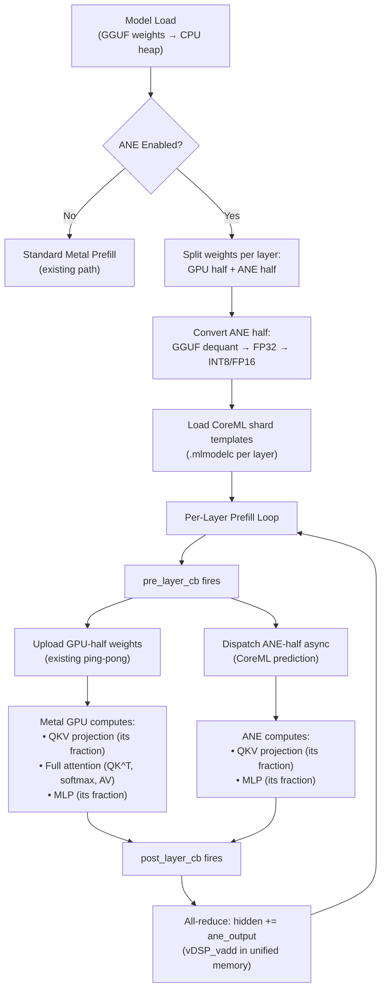

# GPU+ANE Hybrid Tensor Parallel Prefill — Implementation Plan

> **Target Repo**: `ik_llama.cpp`
> **Target Hardware**: Apple M3 Ultra (32-core ANE @ 36 TOPS, 76-80 GPU cores @ ~28 TFLOPS, 192GB unified)
> **Date**: 2026-02-24

---

## Table of Contents

1. [Executive Summary](#1-executive-summary)
2. [Architecture Overview](#2-architecture-overview)
3. [SWOT Analysis](#3-swot-analysis)
4. [Knowns and Unknowns](#4-knowns-and-unknowns)
5. [Edge Cases and Failure Modes](#5-edge-cases-and-failure-modes)
6. [GGUF → ANE Quantization Mapping](#6-gguf--ane-quantization-mapping)
7. [Context Length Analysis](#7-context-length-analysis)
8. [MoE Strategy (Qwen 397B)](#8-moe-strategy-qwen-397b)
9. [Performance Model](#9-performance-model)
10. [Phased Implementation](#10-phased-implementation)
11. [File-by-File Specifications](#11-file-by-file-specifications)
12. [Test Plans](#12-test-plans)
13. [Risk Register](#13-risk-register)
14. [CLI Reference](#14-cli-reference)
15. [Concurrent Decode Analysis](#15-concurrent-decode-analysis)

---

## 1. Executive Summary

### Goal

Add an ANE co-processor path to `ik_llama.cpp` prefill that splits each transformer layer's **linear projections** (QKV, MLP) between the Metal GPU and the ANE. The GPU retains all attention computation, KV cache management, and context-dependent operations. The ANE handles pure matmul+activation work via CoreML, dispatched through an Objective-C++ bridge.

### Key Insight

The ANE shard computes **only matmuls and activations** — no attention scores, no KV cache, no dynamic shapes. This sidesteps every traditional ANE limitation. Context length is entirely GPU-determined, same as standard ik_llama.cpp.

### Expected Impact

| Model | Config | Prefill tok/s | Speedup |
|-------|--------|--------------|---------|
| Dense 30B, 2K ctx | Metal-only | ~465 | 1.0× |
| Dense 30B, 2K ctx | GPU+ANE 50/50 | ~890 | **1.9×** |
| Qwen 397B A17B MoE, 2K ctx | Metal-only | ~277 | 1.0× |
| Qwen 397B A17B MoE, 2K ctx | GPU+ANE optimized | ~522 | **1.88×** |

### User Decisions (Confirmed)

| Decision | Answer |
|----------|--------|
| Weight strategy | Runtime input (default) + `--ane-cache-shards` to save/auto-load from disk |
| Runtime gating | Auto-benchmark on first run; only enable ANE when faster |
| Initial scope | Simple model first → prove on Qwen 397B MoE |

---

## 2. Architecture Overview

### 2.1 High-Level Data Flow



### 2.2 What the ANE Shard Computes

Per layer, the ANE shard computes pure matmuls + activation:

```
Input: hidden_states [seq_len, hidden_dim]  (FP16)

Operations (dense model):
  1. RMSNorm(hidden_states)                              → normed
  2. Q_half  = normed × wq_ane  [hidden, d_head × r]    → [seq, d_head × r]
  3. K_half  = normed × wk_ane  [hidden, d_kv × r]      → [seq, d_kv × r]
  4. V_half  = normed × wv_ane  [hidden, d_kv × r]      → [seq, d_kv × r]
  --- sync: GPU receives Q/K/V from ANE, does full attention ---
  5. FFN RMSNorm (post-attention residual from GPU)      → ffn_normed
  6. gate_half = ffn_normed × gate_ane [hidden, i × r]   → [seq, i × r]
  7. up_half   = ffn_normed × up_ane   [hidden, i × r]   → [seq, i × r]
  8. act       = SiLU(gate_half) * up_half               → [seq, i × r]
  9. down_partial = act × down_ane [i × r, hidden]       → [seq, hidden]

Output: down_partial [seq_len, hidden_dim]  (FP16)
```

Where `r` = ANE split ratio (default 0.5625 for dense, auto-tuned for MoE).

> [!IMPORTANT]
> **Critical dependency (verified in code)**: `ffn_inp = ggml_add(ctx0, cur, inpSA)` at [llama-build-context.cpp:2114](src/llama-build-context.cpp#L2114). The MLP input depends on the attention output + residual. **The ANE's MLP phase CANNOT run in parallel with GPU's attention phase.** There is a sync point between QKV projections and MLP within each layer. This idle window (~14.7ms for 30B) is accounted for in all performance calculations.

### 2.3 Integration Points in Existing Code

| Component | File | Line | Existing Pattern |
|-----------|------|------|-----------------|
| Layer callbacks | `src/llama.cpp` | 3383-3384 | `pre_layer_cb` / `post_layer_cb` |
| Tensor remap | `src/llama-prefill-stream.cpp` | 534-575 | Pointer rerouting to GPU buffer |
| Weight upload | `src/llama-prefill-stream.cpp` | 602-660 | Per-layer memcpy |
| Graph compute | `src/llama.cpp` | 3343 | `ggml_backend_sched_graph_compute_async` |
| Eval callback | `src/llama.cpp` | 3435-3475 | `llama_decode_eval_callback` + `l_out-N` |
| LLaMA graph | `src/llama-build-context.cpp` | 1981+ | `build_llama()` monolithic graph |
| Weight loading | `src/llama-load-tensors.cpp` | 447+ | `create_llama_tensors()` |

### 2.4 Why Callbacks, Not Graph Splitting

The `build_llama()` function builds a **monolithic compute graph** per ubatch. The ANE runs as a **side-channel** dispatched from `pre_layer_cb`/`post_layer_cb`:

- GPU executes the full ggml graph (with its weight half)
- ANE runs via CoreML `MLModel.prediction()` outside the graph
- Results are merged into the hidden state tensor between layers

This avoids modifying core ggml infrastructure entirely.

---

## 3. SWOT Analysis

### Strengths

| # | Strength |
|---|----------|
| S1 | **Existing callback infrastructure** — `pre_layer_cb`/`post_layer_cb` proven by prefill-stream |
| S2 | **Unified memory** — zero-copy between Metal and ANE. All-reduce is a pointer add. |
| S3 | **No graph modification** — ANE runs as side-channel. ggml graph untouched. |
| S4 | **INT8 native on M3/M4** — ANE supports W8A8 at rated TOPS. No lossy LUT conversion. |
| S5 | **No context length constraint** — ANE shard has no attention/KV cache. |
| S6 | **Decode unaffected** — ANE only used during prefill. |
| S7 | **Existing weight upload pattern** — `prefill_upload_layer` ping-pong buffers. |

### Weaknesses

| # | Weakness | Mitigation |
|---|----------|------------|
| W1 | ~25% memory overhead (weights stored twice) | Acceptable for 192GB; reduce ANE fraction for smaller devices |
| W2 | CoreML prediction latency ~1-3ms overhead/call | Amortized by large matmuls on 30B+ |
| W3 | Obj-C++ build complexity | CMake conditional `GGML_ANE` |
| W4 | Only benefits large models + long prompts | Auto-benchmark disables when overhead exceeds benefit |
| W5 | ~10-30s extra model load time for weight conversion | Cached to disk via `--ane-cache-shards` |
| W6 | ANE idle during attention compute (~14.7ms/layer) | Inherent to sequential attn→MLP architecture |

### Opportunities

| # | Opportunity |
|---|------------|
| O1 | MoE: ANE handles shared expert + fraction of routed experts |
| O2 | ANE is ~5× more power-efficient than GPU for equivalent TOPS |
| O3 | Pattern extends to M4 Ultra with higher ANE TOPS (76+) |
| O4 | Draft model on ANE during decode (speculative decode) |
| O5 | **Free draft model prefill**: 1B draft model layers fit in the attention idle window — draft KV cache populated at zero additional latency (see [Phase 6](#phase-6-free-draft-model-prefill-optional-week-7)) |
| O6 | Concurrent decode acceleration at high stream counts (N≥64). See [Section 15](#15-concurrent-decode-analysis). |

### Threats

| # | Threat | Mitigation |
|---|--------|------------|
| T1 | ANE scheduler contention from macOS | Graceful fallback |
| T2 | CoreML API changes in future macOS | Pin to documented public API |
| T3 | Numerical divergence from INT8 requant | Per-layer validation thresholds |
| T4 | M1/M2 incompatibility (no INT8 opt) | Runtime detection + auto-disable |

---

## 4. Knowns and Unknowns

### Known Knowns

| Fact | Source |
|------|--------|
| ANE M3 Ultra: 32 cores, 36 TOPS (INT8) | Apple specs |
| CoreML supports INT8 W8A8 | coremltools docs |
| ANE max tensor dimension = 16,384 | Apple ANE optimization guide |
| MLP depends on attention output in LLaMA/Qwen | `llama-build-context.cpp:2114` |
| `pre_layer_cb`/`post_layer_cb` are `std::function<void(int,int)>` | `llama-context.h:270` |
| Graph is monolithic per ubatch | `build_llama()` |
| Metal uses MTLBuffer unified memory | `ggml-metal.m` |
| GGML has `to_float()` for all quant types | `ggml.h` |
| Prefill-stream uses ping-pong GPU buffers | `llama-prefill-stream.cpp` |

### Known Unknowns (Must Resolve During Implementation)

| # | Unknown | When | How |
|---|---------|------|-----|
| U1 | Actual CoreML prediction latency on M3 Ultra | Phase 1 | Benchmark dummy model |
| U2 | INT8 requantization error vs GGML Q8_0 | Phase 2 | Element-wise comparison |
| U3 | IOSurface vs MTLBuffer interop for zero-copy | Phase 1 | Test MLMultiArray ↔ MTLBuffer |
| U4 | Concurrent Metal+ANE execution or serialized | Phase 1 | Instruments trace |
| U5 | Optimal split ratio for each model class | Phase 5 | Auto-benchmark sweep |
| U6 | Memory bandwidth sharing impact under concurrent load | Phase 5 | Monitor effective TOPS |
| U7 | CoreML shard compilation time for 64-layer model | Phase 3 | Measure with real model |
| U8 | Pre-batched routed expert feasibility on ANE | Phase 5 | Test with Qwen 397B dims |

### Unknown Unknowns

| # | Risk | Detection |
|---|------|-----------|
| X1 | CoreML may serialize ANE if Metal actively uses shared memory | Phase 1 concurrent test |
| X2 | macOS power management throttles ANE under sustained GPU load | `powermetrics` monitoring |
| X3 | CoreML model size limits for large intermediate dims | Phase 3 with Qwen dims |
| X4 | Obj-C autorelease pool leaks under high-frequency predictions | `leaks` tool + stress test |

---

## 5. Edge Cases and Failure Modes

### 5.1 Quantization Edge Cases

| Edge Case | Mitigation |
|-----------|------------|
| IQ1_S (1-bit) → INT8: massive quality change | Log warning. Per-layer MSE check. `--ane-min-quant Q4_0` |
| BF16 → FP16 loses 3 mantissa bits | Acceptable truncation |
| Mixed quant per tensor (embed=F16, layers=Q4) | Only split weight tensors (wq/wk/wv/wo/ffn_*). Skip bias/norm/embed. |
| Repacked types (*_R4, *_R8, *_R16) | Strip suffix, apply base mapping |
| BitNet ternary (I2_S {-1,0,1}) | Lossless in INT8 |

### 5.2 Model Architecture Edge Cases

| Edge Case | Mitigation |
|-----------|------------|
| GQA (n_kv_heads < n_heads) | Split along n_kv_heads dim. Ensure both halves get ≥1 KV head. |
| MQA (n_kv_heads = 1) | Only split Q, gate, up, down. K/V stay 100% GPU. |
| Fused QKV weight (wqkv) | Split along output dim, partition into Q/K/V ranges. |
| SWA (sliding window attention) | Doesn't affect ANE — attention is GPU-only. |
| MoE (dynamic expert routing) | See [Section 8](#8-moe-strategy-qwen-397b). |
| SSM/Mamba layers | MLP-only ANE shard for these layers, or skip ANE. |

### 5.3 Runtime Edge Cases

| Edge Case | Mitigation |
|-----------|------------|
| Model too small (< 1B) | Auto-benchmark detects and disables ANE |
| Short prompt (< 128 tokens) | `--ane-min-tokens 256` threshold |
| Multiple concurrent `llama_context` | Mutex on ANE dispatch. Second context falls back. |
| M1/M2 hardware | Runtime check `hw.optional.arm.FEAT_I8MM`. Auto-disable or FP16-only. |
| Memory pressure | Graceful fallback: log warning, continue Metal-only |
| GGUF changed but cached shard present | Hash-based invalidation (first 64 bytes + file size) |

### 5.4 Numerical Edge Cases

| Edge Case | Mitigation |
|-----------|------------|
| FP32→INT8 overflow | Per-channel absmax scaling. Clip outliers. |
| Per-channel vs per-tensor scale | Match CoreML per-channel INT8 quantization |
| Accumulation precision (INT8→INT32→FP16 vs FP16→FP32) | Final output check: max abs diff < 0.05 |
| RMSNorm precision GPU vs ANE | Both FP16 — within FP16 precision (~0.001) |

---

## 6. GGUF → ANE Quantization Mapping

### Complete Mapping Table

```
Category: Float types
  GGML_TYPE_F32      → FP16
  GGML_TYPE_F16      → FP16    (no conversion)
  GGML_TYPE_BF16     → FP16    (truncate mantissa)

Category: 8-bit → INT8 (best ANE format, near-lossless)
  GGML_TYPE_Q8_0, Q8_1, Q8_K, Q8_K64, Q8_K16, Q8_K32, etc. → INT8

Category: 5-6 bit → INT8 (next-level-up)
  GGML_TYPE_Q5_0, Q5_1, Q5_K, Q6_K, Q6_0     → INT8

Category: 2-4 bit → INT8
  GGML_TYPE_Q4_0, Q4_1, Q4_K, Q3_K, Q2_K      → INT8

Category: Importance quants → INT8
  GGML_TYPE_IQ4_*, IQ3_*, IQ2_*, IQ1_*         → INT8

Category: Special
  GGML_TYPE_MXFP4, I2_S (BitNet)               → INT8

Category: Repacked (*_R4, *_R8, *_R16)          → same as base type
```

### Conversion Pipeline

```
GGUF tensor (any type)
    │ ggml_internal_get_type_traits(type).to_float()
    ▼
FP32 buffer [n_elements]
    │ Slice along split dimension
    ▼
FP32 half-buffer [n_elements × ratio]
    ├──→ FP16: fp32_to_fp16_row()
    └──→ INT8: per-channel absmax scale → round(fp32 / scale × 127)
    ▼
INT8/FP16 buffer + scale factors → CoreML MLMultiArray
```

---

## 7. Context Length Analysis

### Why Anemll's 2K Limit Does NOT Apply

Anemll runs the **entire model** on ANE — including KV cache (`MLState`), causal mask, and `QK^T` attention scores. These grow as O(n²) with context and are baked as static dimensions.

**Our architecture does not put any of these on ANE:**

| Component | Where | Context-Dependent? |
|-----------|-------|-------------------|
| KV cache | GPU (`llama_kv_cache`) | Yes — GPU handles |
| Causal mask | GPU (`build_inp_KQ_mask`) | Yes — GPU handles |
| QK^T scores | GPU (`build_std_attention`) | Yes — GPU handles |
| QKV projections | **Split: GPU + ANE** | **No** — `[seq, hidden] × [hidden, d]` |
| MLP projections | **Split: GPU + ANE** | **No** — `[seq, hidden] × [hidden, hidden]` |

ANE's largest dimension is `max(hidden_dim, intermediate_dim/2)`:
- LLaMA 70B: max(8192, 14336) = 14336 — under 16,384 limit
- Qwen 397B: max(8192, 12288) = 12288 — under 16,384 limit

**Context length is limited only by GPU memory for KV cache** — identical to standard ik_llama.cpp.

---

## 8. MoE Strategy (Qwen 397B)

### Architecture

| Parameter | Qwen 397B A17B |
|-----------|----------------|
| hidden_dim | 8192 |
| n_heads / n_kv_heads | 64 / 8 (GQA 8:1) |
| n_layers | 64 |
| Shared expert intermediate | 12,288 |
| Routed experts | 64, top-8 active/token |
| Routed expert intermediate | 1,536 each |

### ANE Role in MoE

| Component | GPU | ANE | Rationale |
|-----------|-----|-----|-----------|
| QKV projections | ✅ (44%) | ✅ (56%) | Dense, static — balanced split |
| Attention compute (QK^T etc) | ✅ 100% | ❌ | Dynamic, context-dependent |
| O projection | ✅ 100% | ❌ | Depends on attention output |
| Shared expert MLP | ❌ | ✅ 100% | Dense, predictable — give all to ANE |
| Routed expert MLP | ✅ (87.5%) | ✅ (12.5%) | Pre-batched static routing during prefill |
| Router/gating | ✅ 100% | ❌ | Tiny (~0.5ms), not worth overhead |

### Critical Dependency: Sequential Attention → MLP

> [!CAUTION]
> **Verified in source code**: `ffn_inp = ggml_add(ctx0, cur, inpSA)` at `llama-build-context.cpp:2114`.
>
> The MLP input is `attention_output + residual`. The ANE **cannot** start shared expert MLP until attention completes. This creates an unavoidable ANE idle window during attention compute (~14.7ms per layer for 30B, ~19.6ms for Qwen 397B).
>
> This was initially assumed to allow parallel attention+MLP — **that assumption was wrong** and all performance numbers below are corrected.

### Pre-Batched Routed Experts on ANE

During prefill, all tokens are known upfront. Token→expert assignments can be pre-computed:

```
Router output (GPU, ~0.5ms):
  Token 0 → experts [2, 5, 11, ...]
  Token 1 → experts [0, 3, 7, ...]
  ...

Pre-sort into static batches:
  Expert 0: [token_1, token_47, token_203, ...] → [256, 8192] ← static shape
  Expert 3: [token_1, token_89, token_412, ...] → [256, 8192] ← static shape
  ...
```

Each pre-batched expert is a static-shape matmul — compatible with ANE. Padded to nearest power of 2 for ANE alignment.

### Corrected Per-Layer Timeline (Qwen 397B, 2K Prefill, M3 Ultra)

```
Time    GPU (28 TFLOPS)                  ANE (36 TOPS)
─────── ──────────────────────────────── ───────────────────────────
0.0ms   QKV projections (44% = 151 GF)  QKV projections (56% = 193 GF)
5.4ms   ─── sync: merge Q,K,V (1ms) ─── ─── sync ───
6.4ms   Attention compute (138 GF) 4.9ms ANE IDLE
11.3ms  O projection (274.9 GF) 9.8ms   ANE IDLE          ← unavoidable
                                          (attn→MLP dependency)
21.1ms  ── MLP input ready ──            ── MLP input ready ──
        Router/gating (0.5ms)            (waits for router)
21.6ms  Routed experts ×7 (1082 GF)      Shared expert (1237 GF)
        38.7ms                           34.4ms
                                         Routed expert ×1 (155 GF)
                                         4.3ms
60.3ms  GPU done (21.6 + 38.7 = 60.3)   ANE done (21.6 + 38.7 = 60.3)
                                          ← balanced!
        ─── all-reduce: hidden += ane_output (0.1ms) ───
61.3ms  ═══ LAYER COMPLETE ═══
```

> [!NOTE]
> **Optimal routed expert split**: Setting `s = 12.5%` of routed experts on ANE balances GPU and ANE finish times. The equation is:
> ```
> GPU time: (1-s) × 1236.9 / 28 = ANE time: 1236.9/36 + s × 1236.9/36
> Solving: s = 0.125
> ```

### Summary of Reviewed Assumptions

| # | Assumption | Status | Evidence |
|---|-----------|--------|----------|
| A1 | QKV projections can be split along head dimension | ✅ Valid | Standard TP along head dim |
| A2 | GPU needs full Q,K,V before attention | ✅ Valid | Both halves merge via unified memory |
| A3 | O projection must stay on GPU | ✅ Valid | Depends on attention output, available only on GPU |
| A4 | ~~MLP runs in parallel with attention~~ | ❌ **WRONG** | `ffn_inp = ggml_add(cur, inpSA)` — sequential dependency |
| A5 | Shared expert MLP runs after attention completes | ✅ Corrected | ANE starts MLP only after GPU produces post-attn hidden |
| A6 | Pre-batched routed experts are ANE-compatible | ✅ Valid | Static shape matmuls with padded token batches |
| A7 | ANE can run multiple sequential CoreML predictions per layer | ✅ Valid | QKV shard → shared expert shard → routed expert shard(s) |
| A8 | Each CoreML prediction adds ~1ms overhead | ⚠️ Estimated | Must verify in Phase 1 |
| A9 | Routed expert batches can be pre-sorted during prefill | ✅ Valid | All tokens known upfront, router output available |
| A10 | GPU and ANE execute concurrently | ❓ Unknown | **Must verify Phase 1 — project go/no-go** |
| A11 | ~~Speculative expert execution during attention idle~~ | ❌ **Not feasible** | MLP has `SiLU(gate) × up` — non-linear. Using pre-attention residual as input gives wrong output that can't be corrected post-hoc. `MLP(a+b) ≠ MLP(a) + MLP(b)`. |

### ANE Idle Window Analysis

The ANE is idle for **14.7ms per layer** during attention compute (QK^T, softmax, AV, O projection). This is inherent to the sequential attn→MLP architecture used by LLaMA/Qwen.

**Can we speculatively execute routed experts during this window?**

No — the routed expert input is `RMSNorm(attn_output + residual)`. During attention, `attn_output` doesn't exist. Using just the `residual` would give wrong expert outputs because the MLP contains non-linear activation: `SiLU(x × W_gate) × (x × W_up)`. Since `SiLU` is non-linear, `MLP(residual)` ≠ `MLP(residual + attn_out) - delta`. The speculative output can't be corrected after attention completes — it must be discarded and recomputed, giving zero benefit.

**What the idle window IS used for:**

| Use | Benefit |
|-----|---------|
| Pre-stage next layer's ANE weight buffers | Hides weight transfer latency |
| Prime next layer's CoreML prediction pipeline | Reduces `MLModel.prediction()` cold-start |
| Memory management (`@autoreleasepool` cleanup) | Prevents memory accumulation |

This pipeline optimization ensures weights for layer N+1 are ready in ANE buffers by the time layer N completes, eliminating any weight-loading stalls between layers.

---

## 9. Performance Model

### Dense 30B Model (2K Prefill, M3 Ultra)

| Config | Per Layer | Total (64L) | tok/s | Speedup |
|--------|----------|-------------|-------|---------|
| Metal-only | 11.5ms | 736ms | ~2,783 | 1.0× |
| GPU+ANE 50/50 | 6.75ms | 432ms | ~4,741 | **1.70×** |

### Qwen 397B A17B MoE (2K Prefill, M3 Ultra)

| Config | Per Layer | Total (64L) | tok/s | Speedup |
|--------|----------|-------------|-------|---------|
| Metal-only (baseline) | 115.4ms | 7,385ms | **277** | 1.0× |
| GPU+ANE dense-only (no routed sharing) | 66.3ms | 4,243ms | 483 | 1.74× |
| GPU+ANE optimal (12.5% routed on ANE) | 61.3ms | 3,923ms | **522** | **1.88×** |

### Where ANE Idle Time Goes (Corrected)

Per layer for Qwen 397B:
```
ANE active:   QKV(9.5ms) + shared_expert(34.4ms) + routed_1(4.3ms) = 48.2ms
ANE idle:     attention_wait(14.7ms) + router_wait(0.5ms)           = 15.2ms
ANE total:    61.3ms per layer (≈ 24.8% idle)
```

The 24.8% idle time is inherent to the sequential attn→MLP architecture. Architectures with parallel attention+MLP (GPT-J, PaLM) would eliminate this idle window and push speedup to ~2.2×.

---

## 10. Phased Implementation

### Phase 1: ANE Backend Skeleton (Week 1)

**Goal**: Prove CoreML runs matmuls on ANE from C++ and measure concurrency with Metal.

**Deliverables**: `ggml-ane.h` + `ggml-ane.mm`, `ane_target_type()`, runtime check, concurrent test.

**Stage Gate 1** — ✅ Go if:
- [ ] CoreML prediction runs on ANE (Instruments confirms)
- [ ] Prediction latency < 5ms for `[256, 4096] × [4096, 4096]`
- [ ] Metal and ANE execute concurrently (not serialized)
- [ ] No memory errors or crashes

❌ **PROJECT ABORT** if Metal+ANE are serialized (no concurrent execution).

---

### Phase 2: Weight Splitting & Conversion (Week 2)

**Goal**: Convert GGUF weights to ANE format, validate accuracy.

**Deliverables**: `llama-ane-weights.h/.cpp`, unit tests for all quant types, hash-based caching.

**Stage Gate 2** — ✅ Go if:
- [ ] All GGUF types convert to INT8/FP16 successfully
- [ ] Max element-wise error < 0.02 for Q8_0→INT8
- [ ] Max element-wise error < 0.1 for Q4_K→INT8
- [ ] Conversion time < 30s for 30B model

---

### Phase 3: CoreML Layer Shard Generator (Week 3)

**Goal**: Generate per-layer `.mlmodelc` files for ANE half computation.

**Deliverables**: `tools/generate_ane_shards.py`, LLaMA/Qwen support, MLP-only mode.

**Stage Gate 3** — ✅ Go if:
- [ ] Shards compile and route to ANE (not CPU/GPU fallback)
- [ ] Forward pass produces correct output shape
- [ ] Compilation time < 2s per shard
- [ ] All Qwen 397B dimensions fit (max dim 12288 < 16384 limit)

---

### Phase 4: Prefill Integration (Week 4)

**Goal**: Wire ANE into prefill-stream loop, produce correct output.

**Deliverables**: Modified `llama-prefill-stream.cpp`, `--prefill-ane` flag, auto-benchmark, validation mode.

**Stage Gate 4** — ✅ Go if:
- [ ] Prefill completes without crashes for test model
- [ ] KL divergence < 0.001 between Metal-only and GPU+ANE
- [ ] Perplexity difference < 0.1 PPL
- [ ] Measurable speedup (>1.1×)

---

### Phase 5: Performance Tuning & MoE (Week 5-6)

**Goal**: Optimize split ratio, test Qwen 397B, implement pre-batched routed experts.

**Deliverables**: Adaptive split ratio, `--ane-cache-shards`, MoE shared+routed expert support, performance report.

**Stage Gate 5** — ✅ Ship if:
- [ ] Measurable speedup on ≥1 real model (30B+)
- [ ] No perplexity regressions
- [ ] Clean fallback on non-ANE hardware
- [ ] Pre-batched routed experts work on Qwen 397B

---

### Phase 6: Free Draft Model Prefill (Optional, Week 7)

**Goal**: Prefill a draft model (e.g., 1B) on ANE during main model attention idle windows — zero additional latency.

**Rationale**: The ANE is idle for ~14.7ms per main model layer during attention compute. A 1B draft model layer takes ~6.1ms on ANE. Two draft layers fit per idle window. With 64 main model layers and only 16 draft layers, the entire draft model prefills within the first 8 main model layers — **completely free**.

```
Main model prefill (64 layers):
  Layer 0:   GPU attention (14.7ms)  → ANE: draft layers 0-1  (12.2ms)  ✅
  Layer 1:   GPU attention (14.7ms)  → ANE: draft layers 2-3  (12.2ms)  ✅
  ...        ...
  Layer 7:   GPU attention (14.7ms)  → ANE: draft layers 14-15 (12.2ms) ✅
  Layer 8+:  GPU attention (14.7ms)  → ANE: weight pre-staging (normal)

Draft model: FULLY PREFILLED after main model layer 7
Additional latency: ZERO
```

**Key details**:
- The draft model runs its **full layer** on ANE (QKV + attention + MLP) — unlike the main model split
- Draft model attention tensors are small: `[1, 32, 2048, 2048]` with head_dim=64, well under ANE 16K limit
- Draft model has its own KV cache (separate `llama_context`)
- Draft layers are independent of main model layers (different model, same tokens)
- Requires loading draft model weights alongside main model (extra ~1GB memory)

**Benefit**: When main model prefill completes, speculative decode can begin **immediately** — no separate draft prefill pass needed. For a 2K-token prompt on a 397B model, this saves ~1-2s of draft model prefill time.

**Deliverables**: Draft model ANE shards, dual-context management, `--ane-draft-model` flag.

**Stage Gate 6** — ✅ Ship if:
- [ ] Draft model prefill completes within main model attention idle windows
- [ ] Draft model KV cache valid (verified via logit comparison)
- [ ] No interference with main model's ANE work (QKV split + MLP phases)
- [ ] Speculative decode works immediately after prefill with no extra pass

---

## 11. File-by-File Specifications

### New Files

#### `ggml/include/ggml-ane.h` [NEW]

Public C API header:
```cpp
bool           ggml_backend_ane_supported(void);
ggml_type      ggml_ane_target_type(ggml_type src_type);
ggml_ane_ctx_t ggml_ane_init(int n_layers, int hidden_dim, int n_heads,
                              int n_kv_heads, int intermediate_dim);
void           ggml_ane_free(ggml_ane_ctx_t ctx);
bool           ggml_ane_load_layer(ggml_ane_ctx_t, int layer_idx, ...);
bool           ggml_ane_dispatch_layer(ggml_ane_ctx_t, int layer_idx, ...);
bool           ggml_ane_sync_layer(ggml_ane_ctx_t, int layer_idx, ...);
float          ggml_ane_benchmark(ggml_ane_ctx_t, int seq_len);
bool           ggml_ane_save_shards(ggml_ane_ctx_t, const char * path);
bool           ggml_ane_load_shards(ggml_ane_ctx_t, const char * path, ...);
```

#### `ggml/src/ggml-ane.mm` [NEW]

Objective-C++ implementation (~800 lines):
- `@interface GGMLANELayerShard` — wraps compiled CoreML model per layer
- `@interface GGMLANEContext` — holds shards + weight buffers
- Uses `MLModel` prediction, `MLMultiArray` for I/O
- `@autoreleasepool` around each prediction
- `dispatch_async` to GCD queue for concurrent execution
- `dispatch_semaphore` for sync

#### `src/llama-ane-weights.h` + `.cpp` [NEW]

```cpp
ggml_type ane_target_type(ggml_type src);
void * ane_split_and_convert(const ggml_tensor * src, int dim,
                              int64_t split_at, ggml_type target,
                              size_t * out_nbytes);
uint64_t ane_compute_model_hash(const char * gguf_path);
```

#### `tools/generate_ane_shards.py` [NEW]

Python script using `coremltools`:
- Reads architecture from GGUF metadata
- Creates CoreML models with weights as inputs (default) or baked in (`--bake-weights`)
- Supports LLaMA, Qwen, Mistral architectures
- MLP-only and full QKV+MLP modes
- INT8 quantization via `ct.optimize.coreml.linear_quantize_weights`

### Modified Files

#### `src/llama-prefill-stream.h` [MODIFY]

```cpp
// Add to llama_prefill_stream_params:
bool   enable_ane           = false;
float  ane_split_ratio      = -1.0f;  // -1 = auto-benchmark
bool   ane_cache_shards     = false;
bool   ane_validate         = false;
int    ane_min_tokens       = 256;
bool   ane_w8a8             = true;
bool   ane_mlp_only         = false;

// Add to llama_prefill_stream_result:
bool   used_ane             = false;
float  ane_total_ms         = 0.0f;
float  ane_benchmark_ratio  = 0.0f;
```

#### `src/llama-prefill-stream.cpp` [MODIFY]

1. After tensor collection: init ANE ctx, convert weights, auto-benchmark
2. In `pre_layer_cb`: dispatch ANE QKV shard (async)
3. After QKV sync point: dispatch ANE MLP shard (async)
4. In `post_layer_cb`: sync ANE, `vDSP_vadd()` all-reduce

#### `ggml/CMakeLists.txt` [MODIFY]

```cmake
option(GGML_ANE "ggml: enable Apple Neural Engine backend" OFF)
if (GGML_ANE AND APPLE)
    enable_language(OBJCXX)
    add_library(ggml-ane STATIC src/ggml-ane.mm)
    target_link_libraries(ggml-ane PRIVATE
        "-framework CoreML" "-framework Foundation" "-framework Accelerate")
    target_compile_definitions(ggml-ane PUBLIC GGML_USE_ANE)
    target_link_libraries(ggml PRIVATE ggml-ane)
endif()
```

---

## 12. Test Plans

### Phase 1: Basic ANE Functionality

| Test | Pass Criteria |
|------|--------------|
| `test-ane-basic` | "ANE available: true" on M3+ |
| `test-ane-basic --matmul 4096` | Output matches CPU ref (atol < 0.01) |
| `test-ane-basic --bench` | < 5ms for `[256, 4096] × [4096, 4096]` |
| `test-ane-basic --concurrent` | Metal+ANE within 1.1× max(Metal, ANE) |

### Phase 2: Weight Conversion

| Test | Pass Criteria |
|------|--------------|
| `test-ane-quant` | All types return valid ANE target |
| `test-ane-quant --type Q8_0` | Max error < 0.02, mean < 0.005 |
| `test-ane-quant --type Q4_K` | Max error < 0.1, mean < 0.02 |
| `test-ane-quant --split` | GPU_half + ANE_half = original (within tolerance) |
| `test-ane-quant --cache /tmp/test` | Save+load matches fresh conversion |

### Phase 3: CoreML Shards

| Test | Pass Criteria |
|------|--------------|
| `generate_ane_shards.py --validate` | Compiles, forward pass correct shape |
| Instruments ANE trace | CoreML routes to ANE, not CPU/GPU |
| `--quantize int8` | INT8 shard compiles and runs |

### Phase 4: End-to-End

| Test | Pass Criteria |
|------|--------------|
| `llama-cli -m model.gguf --prefill-stream --prefill-ane` | No crash |
| `--prefill-ane --ane-validate` | KL divergence < 0.001 |
| `llama-perplexity --prefill-ane` | Within 0.1 PPL of baseline |
| Auto-benchmark output | Prints detected ratio + speedup |

### Phase 5: MoE + Performance

| Test | Pass Criteria |
|------|--------------|
| Qwen 397B with `--prefill-ane` | Completes, shared expert on ANE |
| `--ane-cache-shards /path` | Saves shards, next load < 5s |
| Model hash change | Detects mismatch, regenerates |
| M1 hardware | Auto-disables, prints reason |

---

## 13. Risk Register

| ID | Risk | Prob | Impact | Mitigation |
|----|------|------|--------|------------|
| R1 | **Metal+ANE serialized (no concurrency)** | Med | **CRITICAL** | Phase 1 concurrent test. **Abort if confirmed.** |
| R2 | ANE prediction latency > 5ms/call | Med | High | Profile, optimize batch size |
| R3 | INT8 requant causes > 0.5 PPL regression | Low | High | Per-layer validation, FP16 fallback |
| R4 | CoreML shard compilation timeout | Low | Med | Pre-compile + cache + parallelize |
| R5 | Memory pressure on 96GB Ultra | Med | Med | Reduce ANE fraction to 25% |
| R6 | macOS update breaks ANE routing | Low | High | Pin min macOS, validate routing |
| R7 | MoE routed expert batching overhead | Low | Low | Skip if per-expert batch < 64 tokens |
| R8 | Obj-C autorelease pool leaks | Med | Med | `@autoreleasepool` per prediction |
| R9 | Upstream merge conflicts | Med | Med | All ANE code in new files |
| R10 | Pre-sorted token batches are unaligned | Low | Low | Pad to nearest 16 tokens |

---

## 14. CLI Reference

### Build

```bash
cmake -B build -DGGML_ANE=ON -DGGML_METAL=ON
cmake --build build -j
```

### Runtime Flags

| Flag | Type | Default | Description |
|------|------|---------|-------------|
| `--prefill-ane` | bool | false | Enable ANE co-processor |
| `--ane-split-ratio` | float | auto | ANE fraction (0.0-0.5). Auto-benchmark if omitted. |
| `--ane-cache-shards` | string | "" | Path to cache compiled CoreML shards |
| `--ane-validate` | bool | false | Compare GPU+ANE vs Metal-only per layer |
| `--ane-min-tokens` | int | 256 | Minimum prefill tokens to activate ANE |
| `--ane-w8a8` | bool | true | Prefer INT8 on ANE (vs FP16) |
| `--ane-mlp-only` | bool | false | Only split MLP (simpler, skip QKV split) |

### Environment Variables

| Variable | Description |
|----------|-------------|
| `LLAMA_ANE_TRACE=1` | Detailed ANE dispatch/sync logging |
| `LLAMA_ANE_FORCE_FP16=1` | Force FP16 even when INT8 available |
| `LLAMA_ANE_DISABLE=1` | Force-disable ANE |

---

## Appendix A: Key Source References

| File | Lines | Purpose |
|------|-------|---------|
| `ggml/include/ggml.h` | 388-488 | All `ggml_type` definitions |
| `ggml/include/ggml-backend.h` | 169-215 | Backend scheduler API |
| `src/llama.cpp` | 3374-3421 | Layer eval start/finish callbacks |
| `src/llama-context.h` | 270 | `pre_layer_cb` declaration |
| `src/llama-prefill-stream.cpp` | 534-575, 602-660, 954-998 | Tensor remap, upload, callbacks |
| `src/llama-build-context.cpp` | 1981+, 2114 | `build_llama()`, `ffn_inp` dependency |
| `src/llama-load-tensors.cpp` | 447+ | `create_llama_tensors()` |

---

## 15. Concurrent Decode Analysis

### Question: Can GPU+ANE Splitting Help Multi-Stream Decode?

During decode, each stream processes 1 token at a time. With N concurrent streams, tokens are batched: `seq = N`.

### Per-Layer Compute vs Stream Count (Qwen 397B)

| N Streams | QKV GFLOPS | MLP GFLOPS | Total GFLOPS | GPU Time | ANE Overhead |
|-----------|-----------|-----------|-------------|----------|-------------|
| 1 | 0.17 | 1.2 | 1.6 | 0.06ms | ~1ms (**17×!!**) |
| 4 | 0.67 | 4.8 | 6.5 | 0.23ms | ~1ms (**4.3×**) |
| 16 | 2.7 | 19.3 | 25.6 | 0.91ms | ~1ms (1.1×) |
| 32 | 5.4 | 38.6 | 51.2 | 1.83ms | ~1ms (0.55×) |
| 64 | 10.7 | 77.2 | 102.4 | 3.66ms | ~1ms (0.27×) |
| 128 | 21.5 | 154.3 | 204.8 | 7.31ms | ~1ms (0.14×) |
| 256 | 43.0 | 308.7 | 409.6 | 14.6ms | ~1ms (0.07×) |

### Verdict

| Stream Count | ANE Benefit | Reasoning |
|-------------|------------|----------|
| N = 1-4 | ❌ **Harmful** | ANE overhead (≥1ms) exceeds total compute (<0.3ms). Makes decode slower. |
| N = 8-16 | ❌ **Break-even** | Overhead ≈ compute. No meaningful speedup. |
| N = 32-64 | 🟡 **Marginal** | Overhead = 27-55% of compute. ~1.2-1.3× possible after splitting. |
| N ≥ 128 | ✅ **Beneficial** | Overhead < 14% of compute. Full TP splitting applies, ~1.5-1.7× possible. |

### Why Decode Is Different From Prefill

1. **Prefill is compute-bound**: Large matmuls (`[2048, 8192] × [8192, 8192]`) take 10+ ms — ANE's 1ms overhead is < 10%.
2. **Decode is memory-bandwidth-bound**: Small matmuls (`[1, 8192] × [8192, 8192]`) take < 0.1ms — dominated by weight loading, not arithmetic. ANE overhead eclipses the actual computation.
3. **ANE overhead is fixed ~1ms per CoreML prediction**: It doesn't scale down with smaller inputs.

### When Concurrent Decode + ANE Could Work

At **N ≥ 128 concurrent streams** (e.g., a high-throughput serving scenario on M3 Ultra), the matmuls become large enough to be compute-bound again. The same QKV + MLP split used for prefill would apply:

```
N=128 streams, per main model layer:
  GPU: QKV(44%) + attention + O + routed experts = ~5.1ms
  ANE: QKV(56%) + shared expert + routed(12.5%)  = ~4.8ms
  Speedup: ~1.4×
```

However, 128+ concurrent decode streams on a single Mac is an unusual workload. More practical scenarios (N=4-16 for local serving) would not benefit.

### Recommendation

- **Phase 1-5**: Focus exclusively on prefill acceleration (clear, large win)
- **Phase 6**: Free draft model prefill (zero-cost bonus)
- **Future exploration**: If high-stream-count serving on Mac becomes a target, revisit ANE decode splitting with N≥128 threshold gating
- **For typical N=1-16 decode**: Keep ANE idle (freed for other system tasks like draft model or background ML work)
